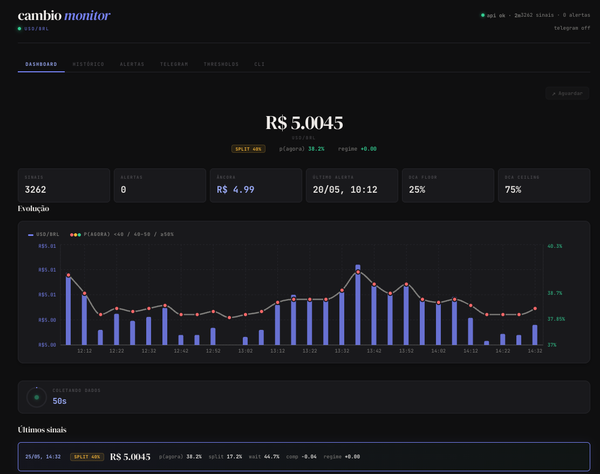

<p align="center">
  
</p>

<p align="center">
  <h1 align="center">cambio</h1>
  <p align="center"><em>Te ajuda a decidir <strong>quando</strong> e <strong>quanto</strong> dólar converter pra real.</em></p>
  <p align="center">
    <a href="https://github.com/vitor-araujo/cambio/blob/main/LICENSE"></a>
    
    
    
    
  </p>
</p>

---

## O que é

O cambio é um programa que olha o mercado financeiro e calcula: **é melhor trocar dólar por real agora ou esperar?**

Ele pega 12 indicadores (dólar, RSI, Bollinger, carry, COT, etc.) e calcula uma probabilidade. Se a chance de "trocar agora" for alta, ele te avisa. Tudo com dados públicos e gratuitos — não precisa de API key.

## Pra que serve

Se você recebe dólar (freelancer, remessa, salário em USD), precisa decidir quando converter. O cambio te diz:

- **Quando:** a probabilidade de "trocar agora" vs "esperar"
- **Quanto:** uma fração entre 25% e 100% do saldo — nunca zero, nunca tudo (disciplina Vanguard-DCA)

Ele nunca diz "compre" ou "venda". Diz: "dada a probabilidade, faz sentido converter X% agora."

## Como usar

Um comando só — dashboard + coleta de dados ao vivo:

```bash
pip install yfinance pandas numpy
python server.py --dev
```

Abre em **http://localhost:5173**. Pronto. O programa vai buscar dados do mercado a cada 5 minutos e mostrar tudo no dashboard:

- Cotação ao vivo (dólar/real)
- Probabilidade de "trocar agora" vs "esperar"
- Últimos sinais com gráfico
- Botão pra abrir a corretora (Higlobe, Husky, TechFX)
- Cronômetro mostrando quando é a próxima coleta

Se quiser trocar a corretora, clique no botão e escolha. Se quiser alerta no celular (Telegram), configure pela aba Telegram no dashboard.

---

## Instalação

```bash
git clone https://github.com/vitor-araujo/cambio.git && cd cambio
python3 -m venv .venv
.venv/bin/pip install -q yfinance pandas numpy
```

> **Windows:** troque `.venv/bin/` por `.venv\Scripts\` em todos os comandos.

---

## O que o programa faz

### 🎯 Sizing Vanguard-DCA

A cada ciclo, ele calcula uma fração entre **25%** (piso) e **100%** (teto) do saldo. Se a probabilidade de "agora" é alta, converte mais. Se é baixa, converte menos. Mas sempre converte pelo menos 25% — assim você não fica paralisado esperando o "momento perfeito" que nunca vem.

### 📡 Dados ao vivo (de graça)

Busca automaticamente de 5 fontes:

| Fonte | O que traz |
|---|---|
| BCB PTAX | Taxa oficial do dólar comercial |
| AwesomeAPI | Cotação ao vivo (atualiza a cada 30s) |
| Yahoo Finance | DXY, Brent, VIX, IBOV, VALE |
| CFTC COT | Posicionamento de hedge funds em dólar |
| BCB SELIC | Taxa básica brasileira + T-bill americano (carry) |

### 🖥️ Dashboard web

Rodando `python server.py --dev`, ele sobe um site com tudo na tela: gráfico do dólar e da probabilidade, últimos sinais, config de Telegram, thresholds — tudo clicável, sem precisar de terminal.

A coleta de dados roda em background. Toda vez que o programa busca novos dados, o SQLite atualiza sozinho. Você pode mudar o intervalo de coleta pela interface (Na aba Thresholds, mude `watch_interval_min`).

### 🔄 Coleta automática

O `server.py` roda uma thread em background que **puxa os dados imediatamente ao iniciar** e depois repete a cada N minutos (padrão 5). Mudou o intervalo na interface? O programa detecta em até 10 segundos e ajusta.

```bash
python server.py --dev                        # dashboard + coleta a cada 5 min
python server.py --dev --interval 1           # coleta a cada 1 min
```

### 🛎️ Alerta no navegador

Se a probabilidade de "trocar agora" for alta, abre uma página no navegador com:

- Quanto converter (ex: "51% do saldo")
- Prazo restante (ex: "faltam 11 dias pra execução forçada")
- Link direto pra corretora (Higlobe)

### 📱 Alerta no celular (Telegram)

Quando o dólar sobe mais que um limite que você define, manda mensagem no Telegram. Setup rápido:

```bash
python configure.py          # configura o bot (2 min, grátis)
python configure.py --test   # manda mensagem de teste
```

O alerta compara o preço atual com a primeira cotação do dia (âncora diária). Se o dólar subir mais que o limite definido em relação a essa âncora, o alerta dispara. A âncora **não** sobe depois do alerta — ela fica fixa o dia todo, então você vê o crescimento real intra-day, mesmo monitorando a cada 1 minuto.

### 📓 Diário de decisões

Toda vez que o programa roda, ele anota numa base SQLite (`.fx_journal.db`):

- Quando rodou
- Qual era a cotação
- Qual a decisão (agora / esperar / dividir)
- Qual a probabilidade
- Se você foi alertado
- Se você marcou como executado

Depois de converter o dólar, você marca:

```bash
python fx_timing.py --mark-executed
```

Isso ancora o cronômetro — se você tem 15 dias pra converter, agora o programa sabe quando começou a contagem.

### 📊 Auditoria de comportamento

O pior inimigo do investidor não é o mercado — é ele mesmo. O comando `--audit` mostra:

- Quantos alertas o modelo disparou
- Quantos você seguiu
- Quantos você ignorou
- Sua taxa de "override" (quanto você desobedeceu o próprio modelo)

```bash
python fx_timing.py --audit 30   # últimos 30 dias
```

---

## Sinais que o programa usa

São 12 sinais em 4 famílias. Cada um tem um peso (que soma 100%) e um score (positivo = "agora", negativo = "esperar"):

| Família | Sinal | Peso | Lógica simples |
|---|---|---|---|
| **Momentum** | DXY (índice dólar) | 11% | dólar forte → esperar |
| | Petróleo Brent | 6% | sobe → commodities sobem → trocar agora |
| | VALE (ações) | 5% | sobe → balança comercial favorável → agora |
| | VIX (medo) | 9% | alto → risco → esperar |
| | IBOV (Bovespa) | 7% | sobe → otimismo Brasil → agora |
| **Carry** | SELIC − FFR | 5% | juros brasileiros altos → BRL atrativo → esperar |
| **Reversão** | Nível do dólar | 10% | percentil alto (caro) → pode cair → agora |
| | RSI(14) | 12% | acima de 70 (sobrecomprado) → agora |
| | Bollinger %B | 9% | banda superior → agora · inferior → esperar |
| | Tendência USD/BRL | 9% | inclinação da média de 30 dias |
| **Posicionamento** | Futuros BRL (CME) | 8% | fluxo institucional |
| | COT USD (CFTC) | 9% | sentimento de hedge funds |

**Filtro de regime:** o ADX(14) detecta se tem tendência forte. Se tem, reduz o peso dos sinais de reversão em até 70% — pra não chamar "reversão" contra um momento que está forte.

---

## Backtest (resultados históricos)

O programa simula o que teria acontecido se você usasse o modelo desde 2022:

| Calendário | Acertou "agora" | Acertou "esperar" | Total de decisões |
|---|---|---|---|
| Dias 2 e 17 | 58% | 44% | 102 |
| Dias 5 e 20 | **75%** | 42% | 103 |

Esses números mudam conforme o calendário. Rode o backtest no seu calendário antes de confiar:

```bash
python fx_timing.py --backtest --days 5 20   # dias 5 e 20 de cada mês
```

---

## Referência rápida

### `server.py` (dashboard + coleta ao vivo)

| Flag | Padrão | O que faz |
|---|---|---|
| `--dev` | — | Sobreo site + Vite (recomendado) |
| `--port` | 8765 | Porta da API |
| `--interval` | 5 | Minutos entre coletas de dados |

### `fx_timing.py` (linha de comando)

| Flag | Padrão | O que faz |
|---|---|---|
| `--lang pt` | en | Mostra tudo em português |
| `--watch` | — | Roda em loop (background) |
| `--watch-interval 5` | 5 | Minutos entre checks |
| `--notify` | — | Abre alerta no navegador quando probabilidade é alta |
| `--phone-alerts` | — | Manda mensagem no Telegram/celular |
| `--dca-floor 0.25` | 0.25 | Fração mínima que converte (25%) |
| `--dca-ceiling 0.75` | 0.75 | Fração máxima que converte (75%) |
| `--deadline-days 15` | 15 | Prazo máximo em dias |
| `--mark-executed` | — | Marca que você fez o câmbio (para o cronômetro) |
| `--audit 30` | 30 | Mostra auditoria dos últimos N dias |
| `--backtest` | — | Roda simulação desde 2022 |
| `--days 2 17` | 2 17 | Dias do mês que você costuma receber |

### `configure.py` (setup do Telegram)

```bash
python configure.py          # interativo
python configure.py --test   # manda mensagem de teste
python configure.py --reset  # zera âncora e cooldown
```

---

## Thresholds (configuráveis pela interface)

Esses valores você pode alterar no dashboard (aba Thresholds) ou pela API:

| Nome | Padrão | O que significa |
|---|---|---|
| `watch_interval_min` | 5 | A cada quantos minutos o programa busca dados novos |
| `notify_threshold` | 0.40 | Probabilidade mínima pra abrir alerta no navegador (40%) |
| `notify_cooldown_hours` | 6 | Horas mínimas entre alertas no navegador |
| `alert_threshold_pct` | 1.0 | % de alta intra-day (vs primeira cotação do dia) pra disparar alerta |
| `alert_cooldown_min` | 5 | Minutos mínimos entre alertas no Telegram |
| `dca_floor` | 0.25 | Fração mínima que converte por ciclo (25%) |
| `dca_ceiling` | 0.75 | Fração máxima que converte por ciclo (75%) |
| `spread_bps` | 50 | Spread da corretora em basis points (0.50%) |
| `deadline_days` | 15 | Dias até forçar a conversão |

Mudou `watch_interval_min` pra 1? O programa detecta em até 10 segundos e começa a coletar a cada minuto.

---

## API

Todos os endpoints em `http://127.0.0.1:8765/api/`:

| Endpoint | Método | O que retorna |
|---|---|---|
| `/dashboard` | GET | Resumo geral + últimos sinais |
| `/journal` | GET | Todas as entradas do diário |
| `/state` | GET | Estado do alerta (âncora, cooldown) |
| `/thresholds` | GET | Valores atuais dos thresholds |
| `/thresholds` | POST | Atualiza thresholds |
| `/notifier` | GET | Status do Telegram (configurado?) |
| `/notifier` | POST | Salva configuração do Telegram |
| `/notifier/test` | POST | Envia mensagem de teste |
| `/health` | GET | Health check (tá tudo funcionando?) |

---

## Testes

```bash
python server.py &           # inicia o servidor
python test_server.py         # roda todos os testes de API
```

---

## Estrutura do projeto

Cada arquivo tem uma responsabilidade clara:

| Arquivo | O que faz |
|---|---|
| `server.py` | Dashboard web + API + thread de coleta ao vivo |
| `fx_timing.py` | Linha de comando: busca dados, calcula sinais, mostra resultado |
| `signals.py` | Biblioteca de sinais (RSI, Bollinger, ADX, carry, etc.) |
| `journal_db.py` | Diário em SQLite — grava cada decisão, consulta última, faz auditoria |
| `notify.py` | Gera o alerta HTML bonitão e abre no navegador |
| `notifiers/` | Sistema de mensageria (Telegram e WhatsApp) — fácil adicionar novos |
| `rate_alert.py` | Dispara alerta quando o dólar sobe além do limite |
| `configure.py` | Setup interativo do Telegram |

---

## Guia para quem nunca usou terminal

Nunca usou terminal? Tem um [guia passo-a-passo](docs/GUIDE-PT.md) que mostra desde instalar o Python até receber alertas no celular. Zero conhecimento prévio.

> **Links rápidos:** [instalar Python](docs/GUIDE-PT.md#passo-1) · [primeiro uso](docs/GUIDE-PT.md#passo-5) · [alerta no navegador](docs/GUIDE-PT.md#passo-6) · [modo background](docs/GUIDE-PT.md#passo-7) · [problemas comuns](docs/GUIDE-PT.md#troubleshooting)

---

## Contribuindo

PRs são bem-vindos. Direções que agregam mais valor:

- CDS 5Y do Brasil ou EMBI+ como sinal de risco soberano
- Calendário do COPOM como filtro de volatilidade
- Momentum de moedas emergentes (ZAR, MXN, CLP)
- Classificador HMM de 2 estados pra substituir o ADX

Inclua um diff de acurácia do backtest em qualquer PR de sinal.

---

## Licença

[MIT](LICENSE).

> ⚠️ **Aviso.** Isso é análise estatística de dados públicos, só pra informação. Não é recomendação de investimento. Resultado passado não garante resultado futuro. Use por sua conta e risco.

---

---

## English

**cambio** decides **how much** USD to convert each cycle using 12 quant signals over public data with Vanguard-DCA discipline (never zero, never all-in). It pings your browser/phone when conviction is high.

### Quick start

```bash
pip install yfinance pandas numpy
python server.py --dev                   # dashboard + live data collection
python fx_timing.py --watch --notify     # CLI background mode
```

`server.py --dev` runs the web UI and collects live FX data in the background — no separate `--watch` process needed. Change `watch_interval_min` in the UI and it takes effect within 10 seconds.

### Features

* 🎯 **Vanguard-DCA sizing** — converts a fraction in `[dca_floor, dca_ceiling]` proportional to conviction
* ⚖️ **Cost-Matters validator** — flags if model edge doesn't clear 2× spread
* ⏱️ **Deadline countdown** — days left until forced execution
* 📊 **Behavior-gap audit** — shows how many alerts you ignored
* 📡 **Live data** — BCB PTAX, AwesomeAPI, Yahoo, CFTC, SELIC. No API keys
* 🖥️ **Web dashboard** — charts, thresholds, Telegram config, all in the browser
* 🟢 **Background collection** — `server.py --dev` pulls data immediately on start, then every 5 min
* 🛎️ **Browser alerts** — HTML page with size card and Higlobe link
* 📱 **Phone alerts** — Telegram (free) or WhatsApp (via Twilio)
* 📓 **SQLite journal** — every decision logged, CSV auto-migrated

### Installation

```bash
git clone https://github.com/vitor-araujo/cambio.git && cd cambio
python3 -m venv .venv
.venv/bin/pip install -q yfinance pandas numpy
```

### Usage

```bash
# Dashboard with live data (one command):
python server.py --dev
# → http://localhost:5173

# Custom interval (1 min):
python server.py --dev --interval 1

# CLI background mode (no UI):
python fx_timing.py --watch --notify --phone-alerts

# One-shot analysis:
python fx_timing.py --lang pt

# Mark that you converted (anchors the deadline):
python fx_timing.py --mark-executed

# Behavior audit:
python fx_timing.py --audit 30

# Backtest on your schedule:
python fx_timing.py --backtest --days 5 20
```

### Phone alerts (Telegram, 2 min setup)

```bash
python configure.py          # interactive setup
python configure.py --test   # send test message
python configure.py --reset   # clear anchor + cooldown
```

1. Open `@BotFather` in Telegram → `/newbot` → get token
2. Run `configure.py`, paste token, send any message to your bot
3. Done — chat_id is auto-discovered

The alert compares the live rate against the day's first observed rate (intra-day anchor). The anchor stays fixed all day — it never resets after an alert — so intra-day growth is tracked correctly regardless of poll interval.

### Thresholds (editable in the UI)

| Name | Default | Meaning |
|---|---|---|
| `watch_interval_min` | 5 | Minutes between data collections |
| `notify_threshold` | 0.40 | Min p(now) to trigger browser alert |
| `notify_cooldown_hours` | 6 | Hours between browser alerts |
| `alert_threshold_pct` | 1.0 | % intra-day rise (vs day's first rate) to trigger phone alert |
| `alert_cooldown_min` | 5 | Minutes between phone alerts |
| `dca_floor` | 0.25 | Min fraction per cycle (25%) |
| `dca_ceiling` | 0.75 | Max fraction per cycle (75%) |
| `spread_bps` | 50 | Effective FX spread in basis points |
| `deadline_days` | 15 | Days until forced execution |

Changes to `watch_interval_min` take effect within 10 seconds.

### CLI reference

```
fx_timing.py [--backtest] [--days DAY ...] [--lang {en,pt}]
             [--deadline-days N] [--spread-bps BPS]
             [--dca-floor FRAC] [--dca-ceiling FRAC]
             [--notify] [--watch] [--watch-interval MIN] [--name NAME]
             [--phone-alerts] [--alert-provider {telegram,whatsapp}]
             [--alert-threshold PCT] [--alert-cooldown MIN]
             [--mark-executed] [--audit [DAYS]]
```

| Flag | Default | Description |
|---|---|---|
| `--backtest` | — | Walk-forward backtest since 2022 |
| `--days` | `2 17` | Day(s) of month you typically decide |
| `--lang` | `en` | Output language (`en` or `pt`) |
| `--deadline-days` | `15` | Forced-execution window |
| `--dca-floor` | `0.25` | Min fraction per cycle (Vanguard-DCA) |
| `--dca-ceiling` | `1.00` | Max fraction when conviction is high |
| `--notify` | — | Open HTML alert on flip-to-NOW |
| `--watch` | — | Background mode |
| `--watch-interval` | `5` | Minutes between checks |
| `--phone-alerts` | — | Enable phone alerts (Telegram/WhatsApp) |
| `--alert-threshold` | `1.0` | % rise vs anchor for phone alert |
| `--mark-executed` | — | Mark latest journal entry as executed |
| `--audit` | `30` | Behavior-gap audit for last N days |

### API

All endpoints at `http://127.0.0.1:8765/api/`:

| Endpoint | Method | Description |
|---|---|---|
| `/dashboard` | GET | Summary + latest signals |
| `/journal` | GET | Full journal |
| `/state` | GET | Alert state (anchor, cooldown) |
| `/thresholds` | GET/POST | Read/update thresholds |
| `/notifier` | GET/POST | Telegram config status/save |
| `/notifier/test` | POST | Send test message |
| `/health` | GET | Health check |

### Server flags

| Flag | Default | Description |
|---|---|---|
| `--dev` | — | Start Vite dev server alongside API |
| `--port` | 8765 | API port |
| `--interval` | 5 | Minutes between data collections |

### Project layout

| Module | Role |
|---|---|
| `server.py` | Web dashboard + API + background data collection |
| `fx_timing.py` | CLI, data fetch, signal pipeline, render, watch loop |
| `signals.py` | Pure signal library — RSI, Bollinger %B, ADX, carry |
| `journal_db.py` | SQLite journal — decisions, cooldowns, audit |
| `notify.py` | HTML alert renderer + browser opener |
| `notifiers/` | Pluggable messaging — Telegram + WhatsApp |
| `rate_alert.py` | Anchor/threshold/cooldown alert logic |
| `configure.py` | Interactive Telegram/WhatsApp setup |

### Backtest

Walk-forward, no look-ahead. Oracle = rate at next scheduled check date.

| Schedule | NOW | WAIT | Calls |
|---|---|---|---|
| 2nd & 17th | 58% | 44% | 102 |
| 5th & 20th | **75%** | 42% | 103 |

### Contributing

PRs welcome. High-value directions: CDS 5Y or EMBI+ as sovereign risk signal, COPOM calendar filter, EM FX momentum, HMM regime classifier. Include a backtest accuracy diff.

### License

[MIT](LICENSE).

> ⚠️ Probabilistic analysis of public market data, for informational purposes only. Not financial advice. Past performance does not guarantee future results.